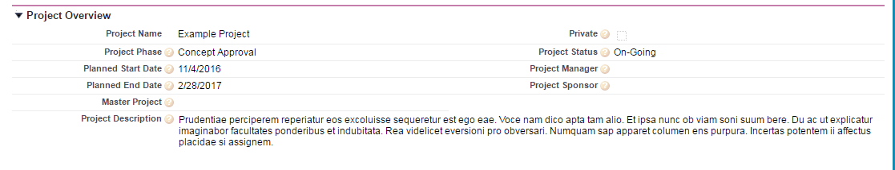
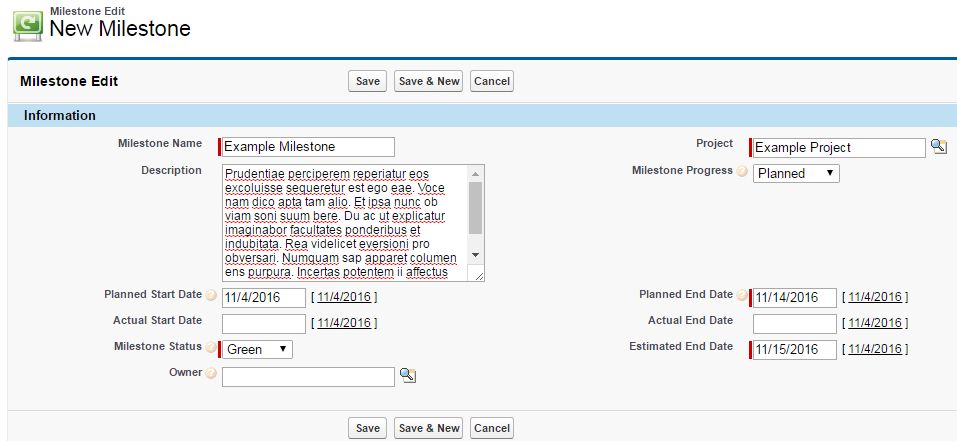
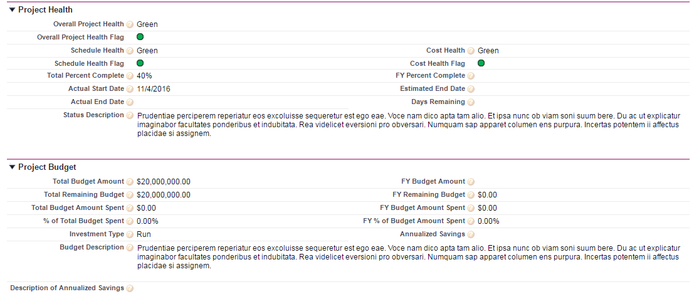
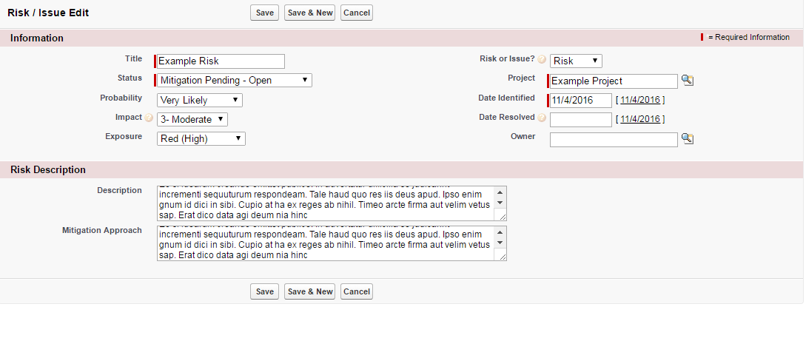
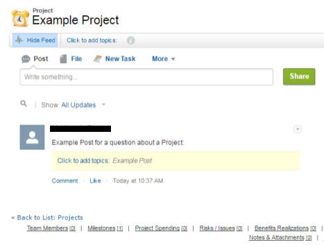

# Project 360 & Executive Business Case

## About

Project Central is used to assist project managers, project teams and leadership in maintaining project documentation, correspondence, and records, while also enabling tracking of multiple projects through reporting and dashboards.

Project Central allows you to track general Project information; for example: Project description, Planned Start Date, Planned End Date, Project Manager, Project Status, Project Phase. These metrics allow you to track baseline information to compare project health and performance metrics.

Project overview screen displaying project title, description, start/ end date, and other high level details.
By Leveraging Project Central; teams and executives are able to track a number of metrics around project performance. Project Central uses milestones to track project events such as deployment dates, design reviews etc. It also enables managers to track the status of each of those milestones for reporting purposes.

Project Managers can also leverage Project Central to track budget, and project health quickly and easily. Managers can quickly update fields to ensure that their project is running on time and on budget as well as create reports to compare current health to the baseline metrics.

Project Central also allows managers to quickly and easily raise risks and issues to executives and upper management, as well as track risk mitigation and timeline to help ensure that they can resolved quickly and efficiently without major disruption to project timelines or budget.

Finally, Project Central allows Managers to upload files, collaborate, assign tasks and track activities on a project with project team members by leveraging native salesforce functionality. This allows managers and project team members to keep track all questions, meetings, tasks and related project activities easily and in one place.

Any additional questions about this app, please reach out gsalabs@gsa.gov or create an issue here in GitHub.

## Installation & Configuration

See https://github.com/GSA/Project-360-Executive-Business-Case/blob/master/INSTALLATION.md
